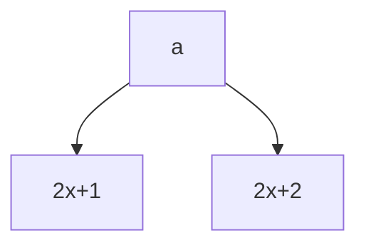
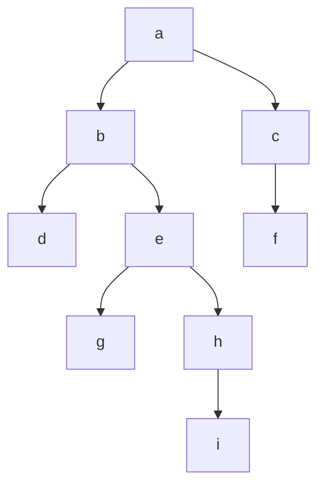

# TODO

- [ ] Expand the notes into something more detail that I can refer to
- [X] Put examples here by getting mermaid to work

# Trees

The root node is at the top of the tree and there can be only one root node

the order of an tree is the maximum amount of children in the tree

the degree of the tree is how many children does the root node have

the height of the tree is the maximum number of the level of a tree

### 2 Tree

it is a tree in which each node has only two nodes (Need to change this)

### Node labelling

The root node is labelled as x and the left node is 2x+1 and right node as 2x+2

Usually the root node is labelled as 0



A complete binary tree is a tree where the nodes labels are continous

A complete binary tree is a tree where the node labels forms a complete interval if there n then node labels must be 

### Full Binary tree

It is a binary tree where all the levels in the binary tree must be completed

### Trasversal

Trasversal is a operation where each element in a tree is a transversed in a systematic order

Two types of searches 

#### Breadth-First Search (BFS)

#### Depth-First Search(DFS)

- Inorder Traversal (Left-Root-Right)
- Preorder Traversal (Root-Left-Right) is used to get a copy of a tree
- Postorder Traversal (Left-Right-Root) is used to delete a a tree

BFS is used if the goal is to reach the end nodes

DFS is used if you want to explore a branch as much as possible

### Array Representation

Visualzing trees as an array

For skew binary trees it's not feasible 

For Complete binary trees is a good option

For Full binary trees also it's a good option

### Linked List Representation

#### T node

| Left Child | data | Right Child|
| ------------- | ---- |  ---- |

**Code example**

```cpp
struct tnode{
    tnode<T> *lchild;
    T data;
    tnode<T> *rchild;
}
```

Empty Tree return null

Single Tree rt->lchild = null
<br />
rt->rchild = null

rt here is the pointer of the tree in the linked list format

### Traversals

**Code for having different Traversals**

```cpp
template <class T>
struct tnode{
    tnode<T> *lchild;
    T data;
    tnode<T> *rchild;
};
class binTree{
    private:
        tnode<T> *rt;
    public:
        binTree();
        void preorder();
        void inorder();
        void postorder();
        void rinorder(tnode<T> *);
        void rpreorder(tnode<T> *);
        void rpostorder(tnode<T> *);
        void create();
        int nodecnt();
        int leafcnt();
        ~binTree();
};
